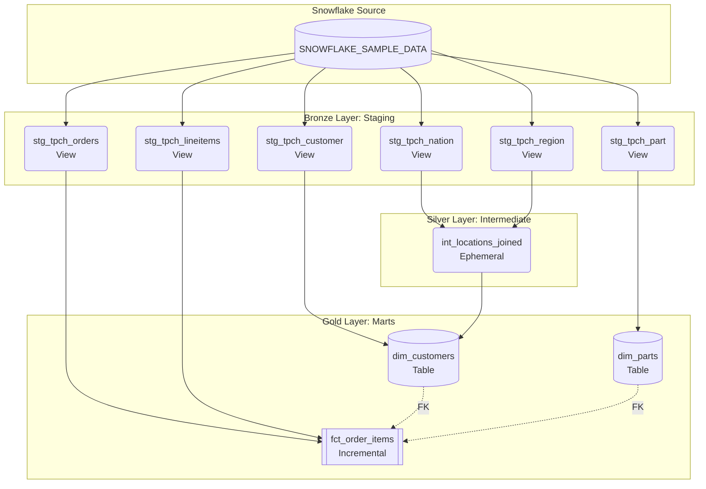

# TPC-H Dimensional Modeling with dbt & Snowflake

This project transforms the standard **Snowflake TPC-H Sample Dataset** (`SNOWFLAKE_SAMPLE_DATA.TPCH_SF1`) into a consumer-ready Star Schema. It leverages **dbt** to execute transformations using the **Medallion Architecture** (Bronze, Silver, Gold).

## 🏛️ High-Level Architecture

The pipeline extracts raw, highly normalized transactional data and processes it through three distinct layers to produce clean, optimized dimensional models for business intelligence and analytics.

### Data Flow & Lineage

## 📂 Layer Definitions
Bronze Layer (models/staging/):

Goal: Create a clean foundation.

Actions: Cast data types, rename columns to snake_case, generate surrogate keys, and apply basic not_null and unique testing. Materialized as lightweight views.

Silver Layer (models/intermediate/):

Goal: Handle complex, reusable business logic before the final layer.

Actions: Denormalize highly relational components (e.g., joining Nation and Region). Materialized as ephemeral to prevent unnecessary storage while keeping code DRY.

Gold Layer (models/marts/):

Goal: Deliver consumer-ready Facts and Dimensions (Star Schema).

Actions: Final joins, metric calculations (e.g., discounted_price), and heavy testing (referential integrity, custom non-negative tests). fct_order_items is materialized as incremental for optimized build times.

## 🚀 Step-by-Step Environment Setup
This project uses uv for lightning-fast Python dependency management.

1. Install uv
If you don't have uv installed yet, install it globally on your machine:

macOS / Linux:

Bash
curl -LsSf [https://astral.sh/uv/install.sh](https://astral.sh/uv/install.sh) | sh
Windows:

PowerShell
powershell -ExecutionPolicy ByPass -c "irm [https://astral.sh/uv/install.ps1](https://astral.sh/uv/install.ps1) | iex"
2. Clone the Repo & Sync Dependencies
Clone this repository and let uv automatically create your virtual environment and install all required dbt packages based on the pyproject.toml and uv.lock files.

Bash
git clone <YOUR_REPOSITORY_URL>
cd dbt-medallion
uv sync
3. Activate the Virtual Environment
Activate the environment where dbt-snowflake is now installed:

macOS / Linux:

Bash
source .venv/bin/activate
Windows:

PowerShell
.venv\Scripts\activate
4. Configure Your dbt Profile (profiles.yml)
dbt needs a profiles.yml file to connect to your Snowflake account.
Create or edit the profiles.yml file in your home directory (~/.dbt/profiles.yml on Mac/Linux or C:\Users\<Your_Username>\.dbt\profiles.yml on Windows) and paste the following configuration:

⚠️ Make sure to replace <YOUR_PASSWORD> with your actual Snowflake password!

YAML
dbt_tpch:
  outputs:
    dev:
      account: PLCQGFK-WAB84100
      database: DBT_DB
      password: '<YOUR_PASSWORD>'
      role: ACCOUNTADMIN
      schema: dbt_dev
      threads: 1
      type: snowflake
      user: ANPHAM1123
      warehouse: COMPUTE_WH
  target: dev
5. Install dbt Packages and Run
Navigate into the specific dbt project folder to install the required dbt macros (dbt_utils) and build the project in Snowflake:

Bash
cd dbt_tpch
dbt deps
dbt build
(The dbt build command will compile the code, run all tests, and build the tables/views in Snowflake).

6. Generate & View Documentation
To explore the data dictionary, column definitions, and lineage graphs visually:

Bash
dbt docs generate
dbt docs serve
This will automatically open a browser tab at http://localhost:8080 showing your project's documentation.
